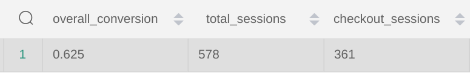

# Answers to Weeks 1 Questions


*How many users do we have?*

130 users

```
  select count(distinct(user_guid)) from "dbt_Shikhar_k"."stg_greenery__user"
```

*On average, how many orders do we receive per hour?*

Approx 7.52 orders per hour on average

```
select round(avg(orders_per_hour),2) as avg_orders_per_hour
from
(
  select count(*) as orders_per_hour from "dbt_Shikhar_k"."stg_greenery__orders"
  group by date_trunc('hour', created_at)
) As A
```

*On average, how long does an order take from being placed to being delivered?*

Approx 3 days & 21:24:11 hours

```
select avg(delivery_time) as avg_delivery_time
from (
  select (delivered_at::timestamp - created_at::timestamp) as delivery_time
  from "dbt_Shikhar_k"."stg_greenery__orders"
  where status = 'delivered' ) A
```

*How many users have only made one purchase? Two purchases? Three+ purchases?*

1  purchase  :: 25 users
2  purchases :: 25 users
3+ purchases :: 71 users
```
with cte_purchases as (
select user_id, count(*) as purchase_count
from "dbt_Shikhar_k"."stg_greenery__orders"
group by user_id ),

cte_purchases_cnt as (
select (case when purchase_count >= 3 then '3+' else purchase_count::varchar end) as freq, 
user_id
from cte_purchases
)

select freq, count(user_id) 
from cte_purchases_cnt
group by freq
```

*On average, how many unique sessions do we have per hour?*

On Average 16.33 sessions per hour

```
with cte_events as (
select date_trunc('hour',created_at), 
count(distinct(session_id)) as distinct_sessions
from "dbt_Shikhar_k"."stg_greenery__events"
group by date_trunc('hour',created_at)
)

select round(avg(distinct_sessions),2)
from cte_events
```


# Answers to Weeks 3 Questions

## What is our overall conversion rate?

``` SQL 
with session_conversion as (
select 
count(DISTINCT(session_id)) as total_sessions,
count(DISTINCT(case when checkout_event >= 1 then session_id end)) as checkout_sessions
from int_user_sessions )

select 
round((checkout_sessions*1.0 / total_sessions),3) as overall_conversion,
total_sessions,
checkout_sessions
from session_conversion
```

**Answer**: 
0.625



## What is the conversion rate by Product?

``` SQL 
SELECT 
name as Product_name,  
round((purchases / page_view), 3) as Product_CR
FROM fct_product_funnel fun
left join stg_greenery__products prod
on fun.product_id = prod.product_guid ORDER BY "product_cr" desc;
```


**Answer**: 

